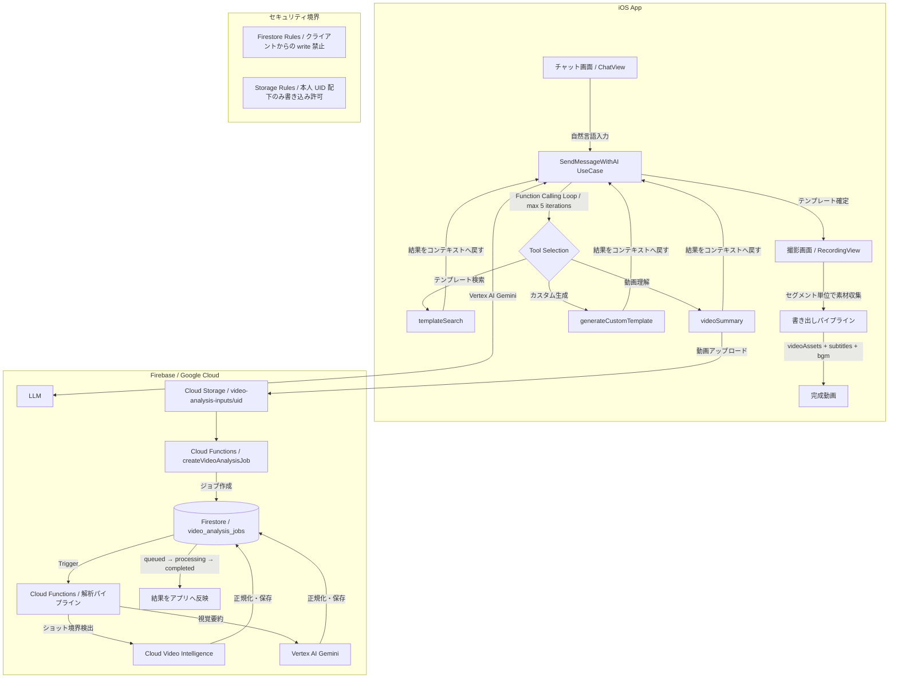

:::message
この記事は **[第4回 Agentic AI Hackathon with Google Cloud](https://zenn.dev/hackathons/google-cloud-japan-ai-hackathon-vol4)** への提出作品です。
大学生4人チームが、iOSアプリ × Vertex AI Gemini × Firebase で「動画制作の完走率」に挑みました。
:::

## デモ動画（約3分）

<!-- 作成したYouTube動画のIDをここに入れてください -->

@[youtube](YOUR_YOUTUBE_VIDEO_ID)

---

## 1. 動画を「見るもの」で止めてしまう、あの感覚

私たちは大学生4人チームです。ショート動画を毎日のように消費しながら、不思議な感覚をずっと共有してきました。

「毎日動画を見ているのに、なぜ自分では1本も投稿したことがないんだろう。」

写真は違います。撮ってすぐ、友人に送れる。編集するにしてもフィルターを1つ選べばいい。ところが動画となった途端に、話がまったく変わります。何を撮るか構成を考え、撮影中は「次のシーンは何だっけ」と段取りを回し続け、全部撮り終えたら今度は素材の整理、字幕、BGM、尺の調整。工程は多く、どこかで手が止まると全部が「下書き」のまま消えていく。

同世代の友人に聞いてみると、反応は驚くほど似通っていました。「構成を考える段階でやる気がなくなる」「撮り終えたあとの編集が面倒で放置している」「センスがないと作れないと思っている」。視聴と制作の間には、技術的というよりも**フロー的な断絶**があると気づいたのは、このときでした。

私たちが作りたかったのは、高機能な編集ツールではありません。**企画から書き出しまでを、1本のレールの上で走らせる体験**です。

---

## 2. 問題の解剖——なぜ「完走できない」のか

「若い層は動画に慣れているはず」という見方は、視聴体験には当てはまります。しかし制作体験には、まったく別のギャップが残っています。CapCutやFinal Cutのような優れた編集アプリが存在しても完走率が上がらないのは、問題が別の場所にあるからだと私たちは考えました。

**企画フェーズ**では、「何をどの順番で撮るか」という意思決定の重さが足かせになります。面白い構成は、センスがある人だけが思いつくものだという思い込みが、撮影開始前に多くの人を止めてしまいます。

**撮影フェーズ**では、「次に撮るべき素材」を頭の中で判断しながら、同時に「撮ること」に集中しなければなりません。クリエイティブな体験が、段取り管理の体験に変質してしまいます。

**編集フェーズ**では、素材の量と種類が一気に増え、初心者にとって最も離脱しやすい場所になります。ここまで続けてきたモチベーションが、素材整理という事務作業で消えていく。

結果として、各フェーズで積み上がった判断コストの総量が「投稿されない下書き動画」を量産し続けます。既存ツールはフェーズ単体には強いですが、**フェーズ間の連続性を設計したものは存在しない**。これが私たちが立った場所です。

---

## 3. ZennVlogとは何か——AIエージェントを「伴走者」にする

ZennVlogはiOSアプリです。まず「なぜiOSか」という問いに答えます。

動画の素材は現場で生まれます。友人との外出先、旅先、イベント会場——制作のきっかけとなる瞬間は、デスクの前ではありません。ポケットにあるデバイスで、撮影の直前に構成を整理し、撮影中にガイドを受け取り、移動中に書き出しまで完了できる。この体験はモバイルでなければ成立しません。AVFoundationによるカメラセッション制御、async/awaitによるストリーミング処理の成熟度が、PoC段階でも実用的な品質を担保できると判断した技術的背景もあります。

アプリの体験は、大きく3つのフェーズで構成されます。

**企画フェーズ**では、チャット画面に「友人の誕生日サプライズの動画を作りたい」と打ち込むだけでいい。AIエージェントが過去の成功テンプレートを検索し、素材として動画を添付すれば内容を解析して、最終的に「撮影順と所要時間が決まったセグメントリスト」を返します。ユーザーはセンスを問われることなく、次のステップに進める状態を手に入れます。

**撮影フェーズ**では、そのセグメントリストがガイドになります。「今、何を撮るべきか」が常に画面に表示され、ユーザーは創作に集中できます。素材の取り漏れが構造的に防がれる仕組みです。

**書き出しフェーズ**では、収集した素材に字幕・BGM・セグメント情報を統合し、完成品として出力します。編集判断をほぼゼロにすることで、「ここで止まる」という体験をなくしています。

### システムアーキテクチャ



---

## 4. エージェントはどう「考えて」動いているか——Agentic性の証明

ただAIのAPIを叩くだけのアプリと、AIエージェントが動くアプリの違いは何か。私たちが最も意識したのはこの問いです。

ZennVlogのチャット機能の中核は`SendMessageWithAIUseCase`です。ユーザーが「旅行Vlogを作りたい、この動画素材も使って」と送ると、エージェントは単純に答えを返しません。まず状況を把握するための**計画**を立てます。「素材動画があるなら内容を把握すべきだ」と判断し、`videoSummary`ツールを呼び出します。

```swift
// SendMessageWithAIUseCase.swift（概念的な実装）
func sendMessageWithFunctionCalling(userMessage: String) async throws -> String {
    var conversationHistory = buildHistory(userMessage)
    var iterationCount = 0

    while iterationCount < maxIterations {
        let response = try await vertexAI.generate(
            messages: conversationHistory,
            tools: [templateSearch, videoSummary, generateCustomTemplate]
        )

        // ツール呼び出しが発生したか観察
        guard let toolCall = response.toolCall else {
            // 最終的な自然言語レスポンスを返す
            return response.text
        }

        // ツールを実行し、結果をコンテキストへ戻す（フィードバックループ）
        let toolResult = try await executeTool(toolCall)
        conversationHistory.append(.toolResult(toolResult))
        iterationCount += 1
    }
    return fallbackResponse
}
```

素材の解析が終わると、エージェントは次に「どのテンプレートが合うか」を**実行**します。`templateSearch`でFirestoreから候補を取得し、その結果を再びコンテキストに積み上げて次のターンの精度を高めます。最終的に既存テンプレートが合わなければ`generateCustomTemplate`で新規生成する、という判断も自律的に行われます。

計画→実行→観察（フィードバック）のループが最大5イテレーション回ることで、ユーザーは「質問に答えている」のではなく、「制作フローが前に進んでいる」感覚を得られます。これがこのアプリにおけるAgentic性の本質です。

### なぜVertex AI Geminiを選んだか

Function Callingのツールスキーマをネイティブでサポートし、動画データをマルチモーダルで直接処理できる点が決め手です。動画素材の内容理解をテキストに変換する`videoSummary`は、動画フレームを直接Geminiに渡すことで実現しています。これを別途OCRや音声認識で代替しようとすると、パイプラインが複雑化し、撮影現場でのリアルタイム性が損なわれます。

### なぜCloud Video Intelligenceを組み合わせたか

Geminiによる意味的な理解と、Video Intelligenceによるショット境界の物理的検出は役割が異なります。「いつシーンが切り替わったか」の正確な時刻情報はVideo Intelligenceが得意とする領域であり、これをGeminiの視覚要約と組み合わせることで、セグメントの`startSec/endSec`を精度高く構造化できます。

---

## 5. 技術的な意思決定——「動けばよい」を選ばなかった理由

PoCという制約の中で、私たちがあえて「手を抜かなかった」場所があります。

**テンプレートデータの人手投資**がその最たる例です。AIの提案品質はモデル性能だけでは決まりません。チームで参考動画を30本以上選定し、各動画を構成の型に分解して、`segments`（`order`, `startSec`, `endSec`, `description`）として構造化しました。Firestoreの`templates`コレクションへの投入スクリプト（`add-template-to-firestore.js`）も整備し、感覚的な運用ではなくデータ管理プロセスとして固定しています。この地道な作業があって初めて、チャットが「撮影順まで落とした具体的な提案」を返せるようになります。

**セキュリティ設計を最初から閉じた**ことも意識的な選択です。PoCでは動作優先で権限設計が後回しになりがちですが、本プロジェクトでは`video_analysis_jobs`のcreate/update/deleteをクライアントから禁止し、参照は認証済みかつ本人ジョブのみに限定しています。Storageへの書き込みも本人UID配下のみに制限しました。「最初は緩く」ではなく「最初から閉じる」という哲学が、拡張時の破綻リスクを下げます。

**動画解析の非同期ジョブ化**も、信頼性を優先した判断です。重処理をアプリ内で同期的に抱えると、ネットワーク断や処理タイムアウトでユーザー体験が壊れます。Callable Functionでジョブを作成し、Firestoreトリガーが`queued → processing → completed/failed`を遷移しながらパイプラインを実行する設計にしました。入力制約（最大180秒・300MB）も明示的に定め、PoC段階から運用を見据えた基盤を選んでいます。

**アーキテクチャの疎結合設計**は、チーム開発の摩擦を減らすためでもありました。`DIContainer`による依存性注入でLive/Mockを切替可能にし、4人が並行して機能を開発しても、他の機能に副作用が出にくい構造を保っています。`ProjectLifecycleManager`で`recording / editing / completed`の状態遷移を明示的にコードで管理することで、機能追加時に「どの状態でどのUIが出るか」を常に追跡可能にしています。

---

## 6. 今後の展開——「完走率」を数字で証明するために

現時点では、実ユーザーでの定量KPIはまだ未計測です。ここは正直に、断定せず記します。

次フェーズで追跡する主な指標は3つです。投稿完了率（開始ユーザーのうち最終書き出しまで到達した割合）、1本完成までの所要時間（初回チャット入力から書き出し完了まで）、そして再編集率（同一プロジェクトの再開回数）。この3つが改善されれば、フロー分断の解消という仮説が検証されたことになります。

テンプレートの提案精度向上も継続的な課題です。母数の拡張、ジャンル別のセグメント粒度の見直し、失敗セッションの分析による質問フロー最適化を段階的に進めます。

長期的には、このアーキテクチャが目指すのは「動画を撮ったことのない人が、初めて1本を完成させる体験」です。そこが達成されたとき、動画は一部のクリエイターの表現手段から、写真と同じ感覚で使える発信ツールへと変わります。私たちが本当に解きたいのは、その変化を起こすための「最初の1本」の壁です。

---

## まとめ

ZennVlogは、動画制作を「編集機能の提供」ではなく、**企画から完走までを支える制作導線の提供**として再定義したプロジェクトです。

大学生4人チームとして、同世代の「動画を見るのに作らない」乖離を実感し、その原因を制作フローの分断として解きほぐし、AIエージェントと実装基盤で埋めることに挑戦しました。

モデル精度だけでなく、テンプレートデータ設計、非同期ジョブ基盤、セキュリティ設計、状態遷移管理まで一体で作る必要がありました。本プロジェクトはその土台を構築したPoCであり、次フェーズではKPI計測を通じて有効性を定量で証明していきます。

| 審査基準         | 本プロジェクトでの主張                                                                                                    |
| ---------------- | ------------------------------------------------------------------------------------------------------------------------- |
| 課題の新規性     | 問題は編集単体ではなく、企画・撮影・編集の分断にある。若い層でも「見る」と「作る」が乖離している構造的な課題に着目した。  |
| 解決策の有効性   | Function Callingループと非同期動画解析ジョブにより、自然言語入力を具体的な制作アクションへ変換するAgentic設計を実現した。 |
| 実装品質と拡張性 | DI/Repository分離、最小権限ルール先行、状態遷移管理、統合エクスポートにより、PoCでも運用を見据えた設計になっている。      |
